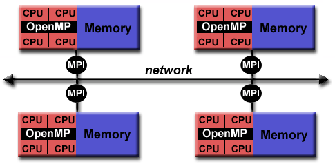
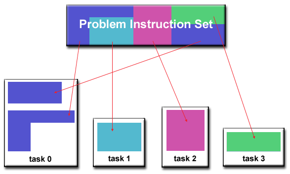

# Introduction to Parallel Computing Tutorial

[Article Link](https://hpc.llnl.gov/training/tutorials/introduction-parallel-computing-tutorial)


## Parallel Computing Overview

### What is Parallel Computing?

__Serial Computing__

- Traditionally, software has been written for serial computation:
    - A problem is broken into a discrete series of instructions
    - Instructions are executed sequentially one after another
    - Executed on a single processor
    - Only one instruction may execute at any moment in time

    

__Parallel Computing__

- In the simplest sense, parallel computing is the simultaneous use of multiple compute resources to solve a computational problem:
    - A problem is broken into discrete parts that can be solved concurrently
    - Each part is further broken down to a series of instructions
    - Instructions from each part execute simultaneously on different processors
    - An overall control/coordination mechanism is employed

    

- The computational problem should be able to:
    - Be broken apart into discrete pieces of work that can be solved simultaneously;
    - Execute multiple program instructions at any moment in time;
    - Be solved in less time with multiple compute resources than with a single compute resource.
- The compute resources are typically:
    - A single computer with multiple processors/cores
    - An arbitrary number of such computers connected by a network

__Parallel Computers__

- Virtually all stand-alone computers today are parallel from a hardware perspective:
    - Multiple functional units (L1 cache, L2 cache, branch, prefetch, decode, floating-point, graphics processing (GPU), integer, etc.)
    - Multiple execution units/cores
    - Multiple hardware threads
- Networks connect multiple stand-alone computers (nodes) to make larger parallel computer clusters.

    


### Who is Using Parallel Computing?

- Parallel computing is now being used extensively around the world, in a wide variety of applications.

    


---

## Concepts and Terminology

### Flynn's Taxonomy

- There are a number of different ways to classify parallel computers.
- One of the more widely used classifications, in use since 1966, is called Flynn's Taxonomy.
- Flynn's taxonomy distinguishes multi-processor computer architectures according to how they can be classified along the two independent dimensions of Instruction Stream and Data Stream. Each of these dimensions can have only one of two possible states: Single or Multiple.
- The matrix below defines the 4 possible classifications according to Flynn:

    

__Single Instruction, Single Data (SISD)__

- A serial (non-parallel) computer
- Single Instruction: Only one instruction stream is being acted on by the CPU during any one clock cycle
- Single Data: Only one data stream is being used as input during any one clock cycle
- Deterministic execution
- This is the oldest type of computer
- Examples: older generation mainframes, minicomputers, workstations and single processor/core PCs.

__Single Instruction, Multiple Data (SIMD)__

- A type of parallel computer
- Single Instruction: All processing units execute the same instruction at any given clock cycle
- Multiple Data: Each processing unit can operate on a different data element
- Best suited for specialized problems characterized by a high degree of regularity, such as graphics/image processing.
- Synchronous (lockstep) and deterministic execution
- Two varieties: Processor Arrays and Vector Pipelines
- Examples:
    - Processor Arrays: Thinking Machines CM-2, MasPar MP-1 & MP-2, ILLIAC IV
    - Vector Pipelines: IBM 9000, Cray X-MP, Y-MP & C90, Fujitsu VP, NEC SX-2, Hitachi S820, ETA10
- Most modern computers, particularly those with graphics processor units (GPUs) employ SIMD instructions and execution units.

    
    
    

__Multiple Instruction, Single Data (MISD)__

- A type of parallel computer
- Multiple Instruction: Each processing unit operates on the data independently via separate instruction streams.
- Single Data: A single data stream is fed into multiple processing units.
- Few (if any) actual examples of this class of parallel computer have ever existed.
- Some conceivable uses might be:
    - multiple frequency filters operating on a single signal stream
    - multiple cryptography algorithms attempting to crack a single coded message.

    
    

__Multiple Instruction, Multiple Data (MIMD)__

- A type of parallel computer
- Multiple Instruction: Every processor may be executing a different instruction stream
- Multiple Data: Every processor may be working with a different data stream
- Execution can be synchronous or asynchronous, deterministic or non-deterministic
- Currently, the most common type of parallel computer - most modern supercomputers fall into this category.
- Examples: most current supercomputers, networked parallel computer clusters and "grids", multi-processor SMP computers, multi-core PCs.
- Note many MIMD architectures also include SIMD execution sub-components

    
    


### Parallel Computing Terminology

- PIPELINING: Breaking a task into steps performed by different processor units, with inputs streaming through, much like an assembly line; a type of parallel computing.

- SHARED MEMORY: Describes a computer architecture where all processors have direct access to common physical memory. In a programming sense, it describes a model where parallel tasks all have the same "picture" of memory and can directly address and access the same logical memory locations regardless of where the physical memory actually exists.

- SYMMETRIC MULTI-PROCESSOR (SMP): Shared memory hardware architecture where multiple processors share a single address space and have equal access to all resources - memory, disk, etc.

- DISTRIBUTED MEMORY: In hardware, refers to network based memory access for physical memory that is not common. As a programming model, tasks can only logically "see" local machine memory and must use communications to access memory on other machines where other tasks are executing.

- COMMUNICATIONS: Parallel tasks typically need to exchange data. There are several ways this can be accomplished, such as through a shared memory bus or over a network.

- COMPUTATIONAL GRANULARITY: In parallel computing, granularity is a quantitative or qualitative measure of the ratio of computation to communication.
    - _Coarse_: relatively large amounts of computational work are done between communication events
    - _Fine_: relatively small amounts of computational work are done between communication events

- OBSERVED SPEEDUP: Observed speedup of a code which has been parallelized, defined as:
    - wall clock time of serial execution / wall clock time of parallel execution

- PARALLEL OVERHEAD: Required execution time that is unique to parallel tasks, as opposed to that for doing useful work. Parallel overhead can include factors such as:
    - Task start-up time
    - Synchronizations
    - Data communications
    - Software overhead imposed by parallel languages, libraries, operating system, etc.
    - Task termination time


### Potential Benefits, Limits and Costs of Parallel Programming

__Amdahl's Law__

- Amdahl's Law states that potential program speedup is defined by the fraction of code (P) that can be parallelized:

$$ speedup = \frac{1}{1-P} $$

- If none of the code can be parallelized, P = 0 and the speedup = 1 (no speedup).
- If all of the code is parallelized, P = 1 and the speedup is infinite (in theory).
- If 50% of the code can be parallelized, maximum speedup = 2, meaning the code will run twice as fast.
- Introducing the number of processors performing the parallel fraction of work, the relationship can be modeled by:

$$ speedup = \frac{1}{(P / N) + S} $$

- where P = parallel fraction, N = number of processors and S = serial fraction.

- It soon becomes obvious that there are limits to the scalability of parallelism. For example:

    
    

- However, certain problems demonstrate increased performance by increasing the problem size.
- Problems that increase the percentage of parallel time with their size are more scalable than problems with a fixed percentage of parallel time.

__Complexity__

- In general, parallel applications are  more complex than corresponding serial applications. Not only do you have multiple instruction streams executing at the same time, but you also have data flowing between them.
- The costs of complexity are measured in programmer time in virtually every aspect of the software development cycle:
    - Design
    - Coding
    - Debugging
    - Tuning
    - Maintenance
- Adhering to "good" software development practices is essential when developing  parallel applications.

__Portability__

- Thanks to standardization in several APIs, such as MPI, OpenMP and POSIX threads, portability issues with parallel programs are not as serious as in years past. However...
- All of the usual portability issues associated with serial programs apply to parallel programs. For example, if you use vendor "enhancements" to Fortran, C or C++, portability will be a problem.
- Even though standards exist for several APIs, implementations will differ in a number of details, sometimes to the point of requiring code modifications in order to effect portability.
- Operating systems can play a key role in code portability issues.
- Hardware architectures are characteristically highly variable and can affect portability.

__Resource Requirements__

- The primary intent of parallel programming is to decrease execution wall clock time, however in order to accomplish this, more CPU time is required. For example, a parallel code that runs in 1 hour on 8 processors actually uses 8 hours of CPU time.
- The amount of memory required can be greater for parallel codes than serial codes, due to the need to replicate data and for overheads associated with parallel support libraries and subsystems.
- For short running parallel programs, there can actually be a decrease in performance compared to a similar serial implementation. The overhead costs associated with setting up the parallel environment, task creation, communications and task termination can comprise a significant portion of the total execution time for short runs.

__Scalability__

- Two types of scaling based on time to solution: strong scaling and weak scaling.

- _Strong scaling (Amdahl)_:
    - The total problem size stays fixed as more processors are added.
    - Goal is to run the same problem size faster
    - Perfect scaling means problem is solved in 1/P time (compared to serial)
- _Weak scaling (Gustafson)_:
    - The problem size per processor stays fixed as more processors are added. The total problem size is proportional to the number of processors used.
    - Goal is to run larger problem in same amount of time
    - Perfect scaling means problem Px runs in same time as single processor run

- The ability of a parallel program's performance to scale is a result of a number of interrelated factors. Simply adding more processors is rarely the answer.
- The algorithm may have inherent limits to scalability. At some point, adding more resources causes performance to decrease. This is a common situation with many parallel applications.
- Hardware factors play a significant role in scalability. Examples:
    - Memory-cpu bus bandwidth on an SMP machine
    - Communications network bandwidth
    - Amount of memory available on any given machine or set of machines
    - Processor clock speed
- Parallel support libraries and subsystems software can limit scalability independent of your application.


---

## Parallel Computer Memory Architectures

### Shared Memory

__General Characteristics__

- Shared memory parallel computers vary widely, but generally have in common the ability for all processors to access all memory as global address space.
- Multiple processors can operate independently but share the same memory resources.
- Changes in a memory location effected by one processor are visible to all other processors.
- Historically, shared memory machines have been classified as _UMA_ and _NUMA_, based upon memory access times.

__Uniform Memory Access (UMA)__

- Most commonly represented today by _Symmetric Multiprocessor (SMP)_ machines
- Identical processors
- Equal access and access times to memory
- Sometimes called CC-UMA - Cache Coherent UMA. Cache coherent means if one processor updates a location in shared memory, all the other processors know about the update. Cache coherency is accomplished at the hardware level.

    

__Non-Uniform Memory Access (NUMA)__

- Often made by physically linking two or more SMPs
- One SMP can directly access memory of another SMP
- Not all processors have equal access time to all memories
- Memory access across link is slower
- If cache coherency is maintained, then may also be called CC-NUMA - Cache Coherent NUMA

    

__Advantages__
- Global address space provides a user-friendly programming perspective to memory
- Data sharing between tasks is both fast and uniform due to the proximity of memory to CPUs

__Disadvantages__
- Primary disadvantage is the lack of scalability between memory and CPUs. Adding more CPUs can geometrically increases traffic on the shared memory-CPU path, and for cache coherent systems, geometrically increase traffic associated with cache/memory management.
- Programmer responsibility for synchronization constructs that ensure "correct" access of global memory.


### Distributed Memory

__General Characteristics__

- Like shared memory systems, distributed memory systems vary widely but share a common characteristic. Distributed memory systems require a communication network to connect inter-processor memory.
- Processors have their own local memory. Memory addresses in one processor do not map to another processor, so there is no concept of global address space across all processors.
- Because each processor has its own local memory, it operates independently. Changes it makes to its local memory have no effect on the memory of other processors. Hence, the concept of cache coherency does not apply.
- When a processor needs access to data in another processor, it is usually the task of the programmer to explicitly define how and when data is communicated. Synchronization between tasks is likewise the programmer's responsibility.
- The network "fabric" used for data transfer varies widely, though it can be as simple as Ethernet.

    

__Advantages__
- Memory is scalable with the number of processors. Increase the number of processors and the size of memory increases proportionately.
- Each processor can rapidly access its own memory without interference and without the overhead incurred with trying to maintain global cache coherency.
- Cost effectiveness: can use commodity, off-the-shelf processors and networking.

__Disadvantages__
- The programmer is responsible for many of the details associated with data communication between processors.
- It may be difficult to map existing data structures, based on global memory, to this memory organization.
- Non-uniform memory access times - data residing on a remote node takes longer to access than node local data.


### Hybrid Distributed-Shared Memory

__General Characteristics__

- The largest and fastest computers in the world today employ both shared and distributed memory architectures.

    

- The shared memory component can be a shared memory machine and/or graphics processing units (GPU).

    

- The distributed memory component is the networking of multiple shared memory/GPU machines, which know only about their own memory - not the memory on another machine. Therefore, network communications are required to move data from one machine to another.

- Current trends seem to indicate that this type of memory architecture will continue to prevail and increase at the high end of computing for the foreseeable future.

__Advantages and Disadvantages__
- Whatever is common to both shared and distributed memory architectures.
- Increased scalability is an important advantage
- Increased programmer complexity is an important disadvantage


---

## Parallel Programming Models

### Parallel Programming Models Overview

- There are several parallel programming models in common use:
    - Shared Memory (without threads)
    - Threads
    - Distributed Memory / Message Passing
    - Data Parallel
    - Hybrid
    - Single Program Multiple Data (SPMD)
    - Multiple Program Multiple Data (MPMD)
- Parallel programming models exist as an abstraction above hardware and memory architectures.
- Although it might not seem apparent, these models are NOT specific to a particular type of machine or memory architecture. In fact, any of these models can (theoretically) be implemented on any underlying hardware. Two examples from the past are discussed below.
    - SHARED MEMORY MODEL ON A DISTRIBUTED MEMORY MACHINE: Kendall Square Research (KSR) ALLCACHE approach. Machine memory was physically distributed across networked machines, but appeared to the user as a single shared memory global address space. Generically, this approach is referred to as "virtual shared memory".

        

    - DISTRIBUTED MEMORY MODEL ON A SHARED MEMORY MACHINE: Message Passing Interface (MPI) on SGI Origin 2000. The SGI Origin 2000 employed the CC-NUMA type of shared memory architecture, where every task has direct access to global address space spread across all machines. However, the ability to send and receive messages using MPI, as is commonly done over a network of distributed memory machines, was implemented and commonly used.

        

- Which model to use? This is often a combination of what is available and personal choice. There is no "best" model, although there certainly are better implementations of some models over others.
- The following sections describe each of the models mentioned above, and also discuss some of their actual implementations.

### Shared Memory Model (without threads)

- In this programming model, processes/tasks share a common address space, which they read and write to asynchronously.
- Various mechanisms such as locks / semaphores are used to control access to the shared memory, resolve contentions and to prevent race conditions and deadlocks.
- This is perhaps the simplest parallel programming model.
- An advantage of this model from the programmer's point of view is that the notion of data "ownership" is lacking, so there is no need to specify explicitly the communication of data between tasks. All processes see and have equal access to shared memory. Program development can often be simplified.
- An important disadvantage in terms of performance is that it becomes more difficult to understand and manage data locality:
    - Keeping data local to the process that works on it conserves memory accesses, cache refreshes and bus traffic that occurs when multiple processes use the same data.
    - Unfortunately, controlling data locality is hard to understand and may be beyond the control of the average user.

    

__Implementations__:
- On stand-alone shared memory machines, native operating systems, compilers and/or hardware provide support for shared memory programming. For example, the POSIX standard provides an API for using shared memory, and UNIX provides shared memory segments (shmget, shmat, shmctl, etc).
- On distributed memory machines, memory is physically distributed across a network of machines, but made global through specialized hardware and software. A variety of SHMEM implementations are available: http://en.wikipedia.org/wiki/SHMEM.

### Threads Model

- This programming model is a type of shared memory programming.
- In the threads model of parallel programming, a single "heavy weight" process can have multiple "light weight", concurrent execution paths.
- For example:
    - The main program a.out is scheduled to run by the native operating system. a.out loads and acquires all of the necessary system and user resources to run. This is the "heavy weight" process.
    - a.out performs some serial work, and then creates a number of tasks (threads) that can be scheduled and run by the operating system concurrently.
    - Each thread has local data, but also, shares the entire resources of a.out. This saves the overhead associated with replicating a program's resources for each thread ("light weight"). Each thread also benefits from a global memory view because it shares the memory space of a.out.
    - A thread's work may best be described as a subroutine within the main program. Any thread can execute any subroutine at the same time as other threads.
    - Threads communicate with each other through global memory (updating address locations). This requires synchronization constructs to ensure that more than one thread is not updating the same global address at any time.
    - Threads can come and go, but a.out remains present to provide the necessary shared resources until the application has completed.

    

__Implementations__:
- From a programming perspective, threads implementations commonly comprise:
    - A library of subroutines that are called from within parallel source code
    - A set of compiler directives imbedded in either serial or parallel source code

- In both cases, the programmer is responsible for determining the parallelism (although compilers can sometimes help).
    - Threaded implementations are not new in computing. Historically, hardware vendors have implemented their own proprietary versions of threads. These implementations differed substantially from each other making it difficult for programmers to develop portable threaded applications.
    - Unrelated standardization efforts have resulted in two very different implementations of threads: POSIX Threads and OpenMP.

__POSIX THREADS__
- Specified by the IEEE POSIX 1003.1c standard (1995). C Language only.
- Part of Unix/Linux operating systems
- Library based
- Commonly referred to as Pthreads.
- Very explicit parallelism; requires significant programmer attention to detail.

__OPENMP__
- Industry standard, jointly defined and endorsed by a group of major computer hardware and software vendors, organizations and individuals.
- Compiler directive based
- Portable / multi-platform, including Unix and Windows platforms
- Available in C/C++ and Fortran implementations
- Can be very easy and simple to use - provides for "incremental parallelism". Can begin with serial code.
- Other threaded implementations are common, but not discussed here:
    - Microsoft threads
    - Java, Python threads
    - CUDA threads for GPUs

- More Information
    - POSIX Threads tutorial: computing.llnl.gov/tutorials/pthreads
    - OpenMP tutorial: hpc.llnl.gov/tuts/openMP

### Distributed Memory / Message Passing Model

- This model demonstrates the following characteristics:
    - A set of tasks that use their own local memory during computation. Multiple tasks can reside on the same physical machine and/or across an arbitrary number of machines.
    - Tasks exchange data through communications by sending and receiving messages.
    - Data transfer usually requires cooperative operations to be performed by each process. For example, a send operation must have a matching receive operation.

    

__Implementations__:
- From a programming perspective, message passing implementations usually comprise a library of subroutines. Calls to these subroutines are imbedded in source code. The programmer is responsible for determining all parallelism.
- Historically, a variety of message passing libraries have been available since the 1980s. These implementations differed substantially from each other making it difficult for programmers to develop portable applications.
- In 1992, the MPI Forum was formed with the primary goal of establishing a standard interface for message passing implementations.
- Part 1 of the Message Passing Interface (MPI) was released in 1994. Part 2 (MPI-2) was released in 1996 and MPI-3 in 2012. All MPI specifications are available on the web at http://www.mpi-forum.org/docs/.
- MPI is the "de facto" industry standard for message passing, replacing virtually all other message passing implementations used for production work. MPI implementations exist for virtually all popular parallel computing platforms. Not all implementations include everything in MPI-1, MPI-2 or MPI-3.

- More Information
    - MPI tutorial: computing.llnl.gov/tutorials/mpi


### Data Parallel Model

- May also be referred to as the Partitioned Global Address Space (PGAS) model.
- The data parallel model demonstrates the following characteristics:
    - Address space is treated globally
    - Most of the parallel work focuses on performing operations on a data set. The data set is typically organized into a common structure, such as an array or cube.
    - A set of tasks work collectively on the same data structure, however, each task works on a different partition of the same data structure.
    - Tasks perform the same operation on their partition of work, for example, "add 4 to every array element".
- On shared memory architectures, all tasks may have access to the data structure through global memory.
- On distributed memory architectures, the global data structure can be split up logically and/or physically across tasks.

    

__Implementations__:
- Currently, there are several parallel programming implementations in various stages of developments, based on the Data Parallel / PGAS model.
- Coarray Fortran: a small set of extensions to Fortran 95 for SPMD parallel programming. Compiler dependent. More information: https://en.wikipedia.org/wiki/Coarray_Fortran
- Unified Parallel C (UPC): an extension to the C programming language for SPMD parallel programming. Compiler dependent. More information: https://upc.lbl.gov/
- Global Arrays: provides a shared memory style programming environment in the context of distributed array data structures. Public domain library with C and Fortran77 bindings. More information: https://en.wikipedia.org/wiki/Global_Arrays
- X10: a PGAS based parallel programming language being developed by IBM at the Thomas J. Watson Research Center. More information: http://x10-lang.org/
- Chapel: an open source parallel programming language project being led by Cray. More information: http://chapel.cray.com/


### Hybrid Model

- A hybrid model combines more than one of the previously described programming models.
- Currently, a common example of a hybrid model is the combination of the message passing model (MPI) with the threads model (OpenMP).
    - Threads perform computationally intensive kernels using local, on-node data
    - Communications between processes on different nodes occurs over the network using MPI
- This hybrid model lends itself well to the most popular (currently) hardware environment of clustered multi/many-core machines.
- Another similar and increasingly popular example of a hybrid model is using MPI with CPU-GPU (Graphics Processing Unit) programming.
    - MPI tasks run on CPUs using local memory and communicating with each other over a network.
    - Computationally intensive kernels are off-loaded to GPUs on-node.
    - Data exchange between node-local memory and GPUs uses CUDA (or something equivalent).
- Other hybrid models are common:
    - MPI with Pthreads
        
        

    - MPI with non-GPU accelerators
        
        


### SPMD and MPMP

__Single Program Multiple Data (SPMD)__
- SPMD is actually a "high level" programming model that can be built upon any combination of the previously mentioned parallel programming models.
- SINGLE PROGRAM: All tasks execute their copy of the same program simultaneously. This program can be threads, message passing, data parallel or hybrid.
- MULTIPLE DATA: All tasks may use different data
- SPMD programs usually have the necessary logic programmed into them to allow different tasks to branch or conditionally execute only those parts of the program they are designed to execute. That is, tasks do not necessarily have to execute the entire program - perhaps only a portion of it.
- The SPMD model, using message passing or hybrid programming, is probably the most commonly used parallel programming model for multi-node clusters.
    
    

__Multiple Program Multiple Data (MPMD)__
- Like SPMD, MPMD is actually a "high level" programming model that can be built upon any combination of the previously mentioned parallel programming models.
- MULTIPLE PROGRAM: Tasks may execute different programs simultaneously. The programs can be threads, message passing, data parallel or hybrid.
- MULTIPLE DATA: All tasks may use different data
- MPMD applications are not as common as SPMD applications, but may be better suited for certain types of problems, particularly those that lend themselves better to functional decomposition than domain decomposition (discussed later under Partitioning).

    


---

## Designing Parallel Programs

### Automatic vs. Manual Parallelization

- Designing and developing parallel programs has characteristically been a very manual process. The programmer is typically responsible for both identifying and actually implementing parallelism.
- Very often, manually developing parallel codes is a time consuming, complex, error-prone and iterative process.
- For a number of years now, various tools have been available to assist the programmer with converting serial programs into parallel programs. The most common type of tool used to automatically parallelize a serial program is a parallelizing compiler or pre-processor.
- A parallelizing compiler generally works in two different ways:

__FULLY AUTOMATIC__
- The compiler analyzes the source code and identifies opportunities for parallelism.
- The analysis includes identifying inhibitors to parallelism and possibly a cost weighting on whether or not the parallelism would actually improve performance.
- Loops (do, for) are the most frequent target for automatic parallelization.

__PROGRAMMER DIRECTED__
- Using "compiler directives" or possibly compiler flags, the programmer explicitly tells the compiler how to parallelize the code.
- May be able to be used in conjunction with some degree of automatic parallelization also.
- The most common compiler generated parallelization is done using on-node shared memory and threads (such as OpenMP).
- If you are beginning with an existing serial code and have time or budget constraints, then automatic parallelization may be the answer. However, there are several important caveats that apply to automatic parallelization:
    - Wrong results may be produced
    - Performance may actually degrade
    - Much less flexible than manual parallelization
    - Limited to a subset (mostly loops) of code
    - May actually not parallelize code if the compiler analysis suggests there are inhibitors or the code is too complex
- The remainder of this section applies to the manual method of developing parallel codes.

### Understand the Problem and the Program

- Programs = algorithms + data + (hardware)
- Undoubtedly, the first step in developing parallel software is to first understand the problem that you wish to solve in parallel. If you are starting with a serial program, this means understanding the existing code also.
- Before spending time in an attempt to develop a parallel solution for a problem, determine whether or not the problem is one that can actually be parallelized.

- Example of an easy-to-parallelize problem:
    - Calculate the potential energy for each of several thousand independent conformations of a molecule. When done, find the minimum energy conformation.

    - This problem is able to be solved in parallel. Each of the molecular conformations is independently determinable. The calculation of the minimum energy conformation is also a parallelizable problem.

- Example of a problem and algorithm with little-to-no parallelism:
    - Calculation of the first 10,000 members of the Fibonacci series (0,1,1,2,3,5,8,13,21,...) by use of the formula:

    $$ F(n) = F(n-1) + F(n-2) $$

    - The calculation of the F(n) value uses those of both F(n-1) and F(n-2), which must be computed first.

    - An example of a parallel algorithm for solving this problem (using Binet's formula):

        
    where
        

- Identify the program's hotspots:
    - Know where most of the real work is being done. The majority of scientific and technical programs usually accomplish most of their work in a few places.
    - Profilers and performance analysis tools can help here
    - Focus on parallelizing the hotspots and ignore those sections of the program that account for little CPU usage.

- Identify bottlenecks in the program:
    - Are there areas that are disproportionately slow, or cause parallelizable work to halt or be deferred? For example, I/O is usually something that slows a program down.
    - May be possible to restructure the program or use a different algorithm to reduce or eliminate unnecessary slow areas

- Identify inhibitors to parallelism. One common class of inhibitor is data dependence, as demonstrated by the Fibonacci sequence above.
- Investigate other algorithms if possible. This may be the single most important consideration when designing a parallel application.
- Take advantage of optimized third party parallel software and highly optimized math libraries available from leading vendors (IBM's ESSL, Intel's MKL, AMD's AMCL, etc.).

### Partitioning

- One of the first steps in designing a parallel program is to break the problem into discrete "chunks" of work that can be distributed to multiple tasks. This is known as decomposition or partitioning.
- There are two basic ways to partition computational work among parallel tasks: _domain decomposition_ and _functional decomposition_.

__Domain Decomposition__
- In this type of partitioning, the data associated with a problem is decomposed. Each parallel task then works on a portion of the data.

    

- There are different ways to partition data:

    

__Functional Decomposition__
- In this approach, the focus is on the computation that is to be performed rather than on the data manipulated by the computation. The problem is decomposed according to the work that must be done. Each task then performs a portion of the overall work.

    

- Functional decomposition lends itself well to problems that can be split into different tasks. For example:
    - ECOSYSTEM MODELING: Each program calculates the population of a given group, where each group's growth depends on that of its neighbors. As time progresses, each process calculates its current state, then exchanges information with the neighbor populations. All tasks then progress to calculate the state at the next time step.

    

    - SIGNAL PROCESSING: An audio signal data set is passed through four distinct computational filters. Each filter is a separate process. The first segment of data must pass through the first filter before progressing to the second. When it does, the second segment of data passes through the first filter. By the time the fourth segment of data is in the first filter, all four tasks are busy.
    
    

### Communications

- There are a number of important factors to consider when designing your program's inter-task communications:

__COMMUNICATION OVERHEAD__
- Inter-task communication virtually always implies overhead.
- Machine cycles and resources that could be used for computation are instead used to package and transmit data.
- Communications frequently require some type of synchronization between tasks, which can result in tasks spending time "waiting" instead of doing work.
- Competing communication traffic can saturate the available network bandwidth, further aggravating performance problems.

__LATENCY VS. BANDWIDTH__
- Latency is the time it takes to send a minimal (0 byte) message from point A to point B. Commonly expressed as microseconds.
- Bandwidth is the amount of data that can be communicated per unit of time. Commonly expressed as megabytes/sec or gigabytes/sec.
- Sending many small messages can cause latency to dominate communication overheads. Often it is more efficient to package small messages into a larger message, thus increasing the effective communications bandwidth.

__VISIBILITY OF COMMUNICATIONS__
- With the Message Passing Model, communications are explicit and generally quite visible and under the control of the programmer.
- With the Data Parallel Model, communications often occur opaque to the programmer, particularly on distributed memory architectures. The programmer may not even be able to know exactly how inter-task communications are being accomplished.

__SYNCHRONOUS VS. ASYNCHRONOUS COMMUNICATIONS__
- Synchronous communications require some type of "handshaking" between tasks that are sharing data. This can be explicitly structured in code by the programmer, or it may happen at a lower level unknown to the programmer.
- Synchronous communications are often referred to as blocking communications since other work must wait until the communications have completed.
- Asynchronous communications allow tasks to transfer data independently from one another. For example, task 1 can prepare and send a message to task 2, and then immediately begin doing other work. When task 2 actually receives the data doesn't matter.
- Asynchronous communications are often referred to as non-blocking communications since other work can be done while the communications are taking place.
- Interleaving computation with communication is the single greatest benefit for using asynchronous communications.

__SCOPE OF COMMUNICATIONS__
- Knowing which tasks must communicate with each other is critical during the design stage of a parallel code. Both of the two scopings described below can be implemented synchronously or asynchronously.
- Point-to-point - involves two tasks with one task acting as the sender/producer of data, and the other acting as the receiver/consumer.
- Collective - involves data sharing between more than two tasks, which are often specified as being members in a common group, or collective. Some common variations (there are more):

    

__EFFICIENCY OF COMMUNICATIONS__
- Oftentimes, the programmer has choices that can affect communications performance. Only a few are mentioned here.
- Which implementation for a given model should be used? Using the Message Passing Model as an example, one MPI implementation may be faster on a given hardware platform than another.
- What type of communication operations should be used? As mentioned previously, asynchronous communication operations can improve overall program performance.
- Network fabric—different platforms use different networks. Some networks perform better than others. Choosing a platform with a faster network may be an option.

__OVERHEAD AND COMPLEXITY__
- Finally, realize that this is only a partial list of things to consider!

    


### Synchronization

- Managing the sequence of work and the tasks performing it is a critical design consideration for most parallel programs.
- Can be a significant factor in program performance (or lack of it)
- Often requires "serialization" of segments of the program.

#### Types of Synchronization

__BARRIER__
- Usually implies that all tasks are involved
- Each task performs its work until it reaches the barrier. It then stops, or "blocks".
- When the last task reaches the barrier, all tasks are synchronized.
- What happens from here varies. Often, a serial section of work must be done. In other cases, the tasks are automatically released to continue their work.

__LOCK / SEMAPHORE__
- Can involve any number of tasks
- Typically used to serialize (protect) access to global data or a section of code. Only one task at a time may use (own) the lock / semaphore / flag.
- The first task to acquire the lock "sets" it. This task can then safely (serially) access the protected data or code.
- Other tasks can attempt to acquire the lock but must wait until the task that owns the lock releases it.
- Can be blocking or non-blocking.

__SYNCHRONOUS COMMUNICATION OPERATIONS__
- Involves only those tasks executing a communication operation.
- When a task performs a communication operation, some form of coordination is required with the other task(s) participating in the communication. For example, before a task can perform a send operation, it must first receive an acknowledgment from the receiving task that it is OK to send.
- Discussed previously in the Communications section.

### Data Dependencies

- A dependence exists between program statements when the order of statement execution affects the results of the program.
- A data dependence results from multiple use of the same location(s) in storage by different tasks.
- Dependencies are important to parallel programming because they are one of the primary inhibitors to parallelism.

#### Examples

__LOOP CARRIED DATA DEPENDENCE__

- The value of A(J-1) must be computed before the value of A(J), therefore A(J) exhibits a data dependency on A(J-1). Parallelism is inhibited.
    
    ```
    DO J = MYSTART, MYEND
        A(J) = A(J-1) * 2.0
    END DO
    ```

- If Task 2 has A(J) and task 1 has A(J-1), computing the correct value of A(J) necessitates:
    - Distributed memory architecture - task 2 must obtain the value of A(J-1) from task 1 after task 1 finishes its computation
    - Shared memory architecture - task 2 must read A(J-1) after task 1 updates it

__LOOP INDEPENDENT DATA DEPENDENCE__
- As with the previous example, parallelism is inhibited. The value of Y is dependent on:
    - Distributed memory architecture - if or when the value of X is communicated between the tasks.
    - Shared memory architecture - which task last stores the value of X.
    
    

- Although all data dependencies are important to identify when designing parallel programs, loop carried dependencies are particularly important since loops are possibly the most common target of parallelization efforts.

- How to Handle Data Dependencies
    - Distributed memory architectures - communicate required data at synchronization points.
    - Shared memory architectures -synchronize read/write operations between tasks.

### Load Balancing

- Load balancing refers to the practice of distributing approximately equal amounts of work among tasks so that all tasks are kept busy all of the time. It can be considered a minimization of task idle time.
- Load balancing is important to parallel programs for performance reasons. For example, if all tasks are subject to a barrier synchronization point, the slowest task will determine the overall performance.

    

#### How to Achieve Load Balance

__EQUALLY PARTITION THE WORK EACH TASK RECEIVES__
- For array/matrix operations where each task performs similar work, evenly distribute the data set among the tasks.
- For loop iterations where the work done in each iteration is similar, evenly distribute the iterations across the tasks.
- If a heterogeneous mix of machines with varying performance characteristics are being used, be sure to use some type of performance analysis tool to detect any load imbalances. Adjust work accordingly.

__USE DYNAMIC WORK ASSIGNMENT__
- Certain classes of problems result in load imbalances even if data is evenly distributed among tasks
    - Sparse arrays - some tasks will have actual data to work on while others have mostly "zeros".	
    - Adaptive grid methods - some tasks may need to refine their mesh while others don't.	
    - N-body simulations - particles may migrate across task domains requiring more work for some tasks.

- When the amount of work each task will perform is intentionally variable, or is unable to be predicted, it may be helpful to use a scheduler-task pool approach. As each task finishes its work, it receives a new piece from the work queue.

    

- Ultimately, it may become necessary to design an algorithm which detects and handles load imbalances as they occur dynamically within the code.

### Granularity

__Computation / Communication Ratio__
- In parallel computing, granularity is a qualitative measure of the ratio of computation to communication.
- Periods of computation are typically separated from periods of communication by synchronization events.

__Fine-grain Parallelism__
- Relatively small amounts of computational work are done between communication events.
- Low computation to communication ratio.
- Facilitates load balancing.
- Implies high communication overhead and less opportunity for performance enhancement.
- If granularity is too fine it is possible that the overhead required for communications and synchronization between tasks takes longer than the computation.

    

__Coarse-grain Parallelism__
- Relatively large amounts of computational work are done between communication/synchronization events
- High computation to communication ratio
- Implies more opportunity for performance increase
- Harder to load balance efficiently

    

__Which is Best?__
- The most efficient granularity is dependent on the algorithm and the hardware environment in which it runs.
- In most cases the overhead associated with communications and synchronization is high relative to execution speed so it is advantageous to have coarse granularity.
- Fine-grain parallelism can help reduce overheads due to load imbalance.

### I/O

__The Bad News__
- I/O operations are generally regarded as inhibitors to parallelism.
- I/O operations require orders of magnitude more time than memory operations.
- Parallel I/O systems may be immature or not available for all platforms.
- In an environment where all tasks see the same file space, write operations can result in file overwriting.
- Read operations can be affected by the file server's ability to handle multiple read requests at the same time.
- I/O that must be conducted over the network (NFS, non-local) can cause severe bottlenecks and even crash file servers.

    

__The Good News__
- Parallel file systems are available. For example:
    - GPFS: General Parallel File System (IBM). Now called IBM Spectrum Scale.
    - Lustre: for Linux clusters (Intel)
    - HDFS: Hadoop Distributed File System (Apache)
    - PanFS: Panasas ActiveScale File System for Linux clusters (Panasas, Inc.)
    - And more - see http://en.wikipedia.org/wiki/List_of_file_systems#Distributed_parallel_file_systems

- The parallel I/O programming interface specification for MPI has been available since 1996 as part of MPI-2. Vendor and "free" implementations are now commonly available.

- A few pointers:
    - Rule #1: Reduce overall I/O as much as possible.
    - If you have access to a parallel file system, use it.
    - Writing large chunks of data rather than small chunks is usually significantly more efficient.
    - Fewer, larger files performs better than many small files.
    - Confine I/O to specific serial portions of the job, and then use parallel communications to distribute data to parallel tasks. For example, Task 1 could read an input file and then communicate required data to other tasks. Likewise, Task 1 could perform write operation after receiving required data from all other tasks.
    - Aggregate I/O operations across tasks - rather than having many tasks perform I/O, have a subset of tasks perform it.

### Debugging

- Debugging parallel codes can be incredibly difficult, particularly as codes scale upwards.
- The good news is that there are some excellent debuggers available to assist:
    - Threaded - pthreads and OpenMP
    - MPI
    - GPU / accelerator
    - Hybrid

- Livermore Computing users have access to several parallel debugging tools installed on LC's clusters:
    - TotalView from RogueWave Software
    - DDT from Allinea
    - Inspector from Intel
    - Stack Trace Analysis Tool (STAT) - locally developed at LLNL

- All of these tools have a learning curve associated with them.
- For details and getting started information, see:
    - LC's web pages at https://hpc.llnl.gov/software/development-environment-software
    - TotalView tutorial: https://computing.llnl.gov/tutorials/totalview/

### Performance Analysis and Tuning

- As with debugging, analyzing and tuning parallel program performance can be much more challenging than for serial programs.
- Fortunately, there are a number of excellent tools for parallel program performance analysis and tuning.
- Livermore Computing users have access to several such tools, most of which are available on all production clusters.
- Some starting points for tools installed on LC systems:
    - LC's web pages at https://hpc.llnl.gov/software/development-environment-software
    - TAU: http://www.cs.uoregon.edu/research/tau/docs.php
    - HPCToolkit: http://hpctoolkit.org/documentation.html
    - Open|Speedshop: https://www.openspeedshop.org/
    - Vampir / Vampirtrace: http://vampir.eu/
    - Valgrind: http://valgrind.org/
    - PAPI: http://icl.cs.utk.edu/papi/
    - mpiP: http://mpip.sourceforge.net/
    - memP: http://memp.sourceforge.net/


---

## Parallel Examples

### Array Processing

- This example demonstrates calculations on 2-dimensional array elements; a function is evaluated on each array element.

    

- The computation on each array element is independent from other array elements.
- The problem is computationally intensive.
- The serial program calculates one element at a time in sequential order.
- Serial code could be of the form:

    ```
    do j = 1, n
        do i = 1, n
            a(i, j) = fcn(i, j)
        end do
    end do
    ```

- Questions to ask:
    - Is this problem able to be parallelized?
    - How would the problem be partitioned?
    - Are communications needed?
    - Are there any data dependencies?
    - Are there synchronization needs?
    - Will load balancing be a concern?

#### Parallel Solution 1

- The calculation of elements is independent of one another - leads to an embarrassingly parallel solution.
- Arrays elements are evenly distributed so that each process owns a portion of the array (subarray).
    - Distribution scheme is chosen for efficient memory access; e.g. unit stride (stride of 1) through the subarrays. Unit stride maximizes cache/memory usage.
    - Since it is desirable to have unit stride through the subarrays, the choice of a distribution scheme depends on the programming language. See the Block - Cyclic Distributions Diagram for the options.

        

- Independent calculation of array elements ensures there is no need for communication or synchronization between tasks.
- Since the amount of work is evenly distributed across processes, there should not be load balance concerns.
- After the array is distributed, each task executes the portion of the loop corresponding to the data it owns.
- For example, both Fortran (column-major) and C (row-major) block distributions are shown:

- Column-major:
    ```
    do j = mystart, myend 
        do i = 1, n 
            a(i,j) = fcn(i,j) 
        end do 
    end do
    ```

- Row-major:
    ```
    for i (i=mystart; i<myend; i++) {
        for j (j=0; j<n; j++) {
            a(i, j) = fcn(i, j);
        }
    }
    ```

- Notice that only the outer loop variables are different from the serial solution.

__ONE POSSIBLE SOLUTION:__
- Implement as a Single Program Multiple Data (SPMD) model - every task executes the same program.
- Master process initializes array, sends info to worker processes and receives results.
- Worker process receives info, performs its share of computation and sends results to master.
- Using the Fortran storage scheme, perform block distribution of the array.

- Pseudo code solution:

    ```
    find out if I am MASTER or WORKER
        
    if I am MASTER
        
        initialize the array
        send each WORKER info on part of array it owns
        send each WORKER its portion of initial array
        
        receive from each WORKER results
        
    else if I am WORKER
        receive from MASTER info on part of array I own
        receive from MASTER my portion of initial array

        # calculate my portion of array
        do j = my first column,my last column
            do i = 1,n
                a(i,j) = fcn(i,j)
            end do
        end do

        send MASTER results

    endif
    ```

[Example MPI Array Program in C](./code_samples/mpi_array.c)

#### Parallel Solution 2: Pool of Tasks

- The previous array solution demonstrated static load balancing:
    - Each task has a fixed amount of work to do
    - May be significant idle time for faster or more lightly loaded processors - slowest tasks determines overall performance.
- Static load balancing is not usually a major concern if all tasks are performing the same amount of work on identical machines.
- If you have a load balance problem (some tasks work faster than others), you may benefit by using a "pool of tasks" scheme.

__POOL OF TASKS SCHEME__
- Two processes are employed

- Master Process:
    - Holds pool of tasks for worker processes to do
    - Sends worker a task when requested
    - Collects results from workers

- Worker Process: repeatedly does the following
    - Gets task from master process
    - Performs computation
    - Sends results to master
    - Worker processes do not know before runtime which portion of array they will handle or how many tasks they will perform.
    - Dynamic load balancing occurs at run time: the faster tasks will get more work to do.

- Pseudo code solution:

    ```
    find out if I am MASTER or WORKER

    if I am MASTER

        do until no more jobs
            if request send to WORKER next job
            else receive results from WORKER
        end do

    else if I am WORKER

        do until no more jobs
            request job from MASTER
            receive from MASTER next job

            calculate array element: a(i,j) = fcn(i,j)

            send results to MASTER
        end do

    endif
    ```

__DISCUSSION__
- In the above pool of tasks example, each task calculated an individual array element as a job. The computation to communication ratio is finely granular.
- Finely granular solutions incur more communication overhead in order to reduce task idle time.
- A more optimal solution might be to distribute more work with each job. The "right" amount of work is problem dependent.

### PI Calculation

- The value of PI can be calculated in various ways. Consider the Monte Carlo method of approximating PI:
    - Inscribe a circle with radius r in a square with side length of 2r
    - The area of the circle is Πr2 and the area of the square is 4r2
    - The ratio of the area of the circle to the area of the square is:
    - $\pi r^2$ / $4 r^2$ = $\pi / 4$
    - If you randomly generate N points inside the square, approximately
    - N * $\pi / 4$ of those points (M) should fall inside the circle.
    - $\pi$ is then approximated as:
        - N * $\pi / 4$ = M
        - $\pi / 4$ = M / N
        - $\pi$ = 4 * M / N
    - Note that increasing the number of points generated improves the approximation.

    

- Serial pseudo code for this procedure:

    ```
    npoints = 10000
    circle_count = 0

    do j = 1,npoints
        generate 2 random numbers between 0 and 1
        xcoordinate = random1
        ycoordinate = random2
        if (xcoordinate, ycoordinate) inside circle
        then circle_count = circle_count + 1
    end do

    PI = 4.0*circle_count/npoints
    ```

- The problem is computationally intensive—most of the time is spent executing the loop
- Questions to ask:
    - Is this problem able to be parallelized?
    - How would the problem be partitioned?
    - Are communications needed?
    - Are there any data dependencies?
    - Are there synchronization needs?
    - Will load balancing be a concern?

__Parallel Solution__
- Another problem that's easy to parallelize:
    - All point calculations are independent; no data dependencies
    - Work can be evenly divided; no load balance concerns
    - No need for communication or synchronization between tasks
- Parallel strategy:
    - Divide the loop into equal portions that can be executed by the pool of tasks
    - Each task independently performs its work
    - A SPMD model is used
    - One task acts as the master to collect results and compute the value of PI

    

- Pseudo code solution:

    ```
    npoints = 10000
    circle_count = 0

    p = number of tasks
    num = npoints/p

    find out if I am MASTER or WORKER

    do j = 1,num
        generate 2 random numbers between 0 and 1
        xcoordinate = random1
        ycoordinate = random2
        if (xcoordinate, ycoordinate) inside circle
        then circle_count = circle_count + 1
    end do

    if I am MASTER

        receive from WORKERS their circle_counts
        compute PI (use MASTER and WORKER calculations)

    else if I am WORKER

        send to MASTER circle_count

    endif
    ```

[Example MPI PI Calculation in C](./code_samples/mpi_pi_reduce.c)

### Simple Heat Equation

- Most problems in parallel computing require communication among the tasks. A number of common problems require communication with "neighbor" tasks.
- The 2-D heat equation describes the temperature change over time, given initial temperature distribution and boundary conditions.

    

- A finite differencing scheme is employed to solve the heat equation numerically on a square region.
    - The elements of a 2-dimensional array represent the temperature at points on the square.
    - The initial temperature is zero on the boundaries and high in the middle.
    - The boundary temperature is held at zero.
    - A time stepping algorithm is used.


- The calculation of an element is dependent upon neighbor element values:

    

    

- A serial program would contain code like:

    ```
    do iy = 2, ny - 1
        do ix = 2, nx - 1
        u2(ix, iy) =  u1(ix, iy)  +
            cx * (u1(ix+1,iy) + u1(ix-1,iy) - 2.*u1(ix,iy)) +
            cy * (u1(ix,iy+1) + u1(ix,iy-1) - 2.*u1(ix,iy))
        end do
    end do
    ```

- Questions to ask:
    - Is this problem able to be parallelized?
    - How would the problem be partitioned?
    - Are communications needed?
    - Are there any data dependencies?
    - Are there synchronization needs?
    - Will load balancing be a concern?

__Parallel Solution__
- This problem is more challenging, since there are data dependencies, which require communications and synchronization.
- The entire array is partitioned and distributed as subarrays to all tasks. Each task owns an equal portion of the total array.

    

- Because the amount of work is equal, load balancing should not be a concern
- Determine data dependencies:
    - interior elements belonging to a task are independent of other tasks
    - border elements are dependent upon a neighbor task's data, necessitating communication.
- Implement as an SPMD model:
    - Master process sends initial info to workers, and then waits to collect results from all workers
    - Worker processes calculate solution within specified number of time steps, communicating as necessary with neighbor processes
- Pseudo code solution:

    ```
    find out if I am MASTER or WORKER

    if I am MASTER
        initialize array
        send each WORKER starting info and subarray
        receive results from each WORKER

    else if I am WORKER
        receive from MASTER starting info and subarray

        # Perform time steps
        do t = 1, nsteps
            update time
            send neighbors my border info
            receive from neighbors their border info
            update my portion of solution array
        
        end do
        
        send MASTER results
            
    endif
    ```

[Example Heat Equation Calculation in C](./code_samples/mpi_heat2D.c)

### 1-D Wave Equation

- In this example, the amplitude along a uniform, vibrating string is calculated after a specified amount of time has elapsed.
- The calculation involves:
    - the amplitude on the y axis
    - i as the position index along the x axis
    - node points imposed along the string
    - update of the amplitude at discrete time steps.

    

- The equation to be solved is the one-dimensional wave equation:

$$ A(i,t+1) = (2.0 * A(i,t)) - A(i,t-1) + (c * (A(i-1,t) - (2.0 * A(i,t)) + A(i+1,t))) $$

where c is a constant

- Note that amplitude will depend on previous timesteps (t, t-1) and neighboring points (i-1, i+1).

- Questions to ask:
    - Is this problem able to be parallelized?
    - How would the problem be partitioned?
    - Are communications needed?
    - Are there any data dependencies?
    - Are there synchronization needs?
    - Will load balancing be a concern?

__1-D Wave Equation Parallel Solution__
- This is another example of a problem involving data dependencies. A parallel solution will involve communications and synchronization.
- The entire amplitude array is partitioned and distributed as subarrays to all tasks. Each task owns an equal portion of the total array.
- Load balancing: all points require equal work, so the points should be divided equally
- A block decomposition would have the work partitioned into the number of tasks as chunks, allowing each task to own mostly contiguous data points.
- Communication need only occur on data borders. The larger the block size the less the communication.

    

- Implement as an SPMD model:
    - Master process sends initial info to workers, and then waits to collect results from all workers
    - Worker processes calculate solution within specified number of time steps, communicating as necessary with neighbor processes

- Pseudo code solution:

    ```
    find out number of tasks and task identities

    #Identify left and right neighbors
    left_neighbor = mytaskid - 1
    right_neighbor = mytaskid +1
    if mytaskid = first then left_neigbor = last
    if mytaskid = last then right_neighbor = first

    find out if I am MASTER or WORKER
    if I am MASTER
        initialize array
        send each WORKER starting info and subarray
    else if I am WORKER`
        receive starting info and subarray from MASTER
    endif

    #Perform time steps
    #In this example the master participates in calculations
    do t = 1, nsteps
        send left endpoint to left neighbor
        receive left endpoint from right neighbor
        send right endpoint to right neighbor
        receive right endpoint from left neighbor

        #Update points along line
        do i = 1, npoints
            newval(i) = (2.0 * values(i)) - oldval(i) + (sqtau * (values(i-1) - (2.0 * values(i)) + values(i+1)))
        end do

    end do

    #Collect results and write to file
    if I am MASTER
        receive results from each WORKER
        write results to file
    else if I am WORKER
        send results to MASTER
    endif
    ```

[Example 1-D Wave Equation Calculation in C](./code_samples/mpi_wave.c)


