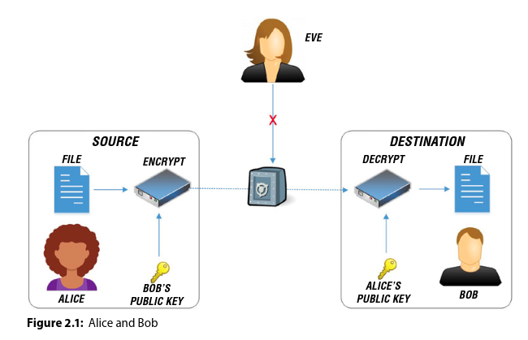
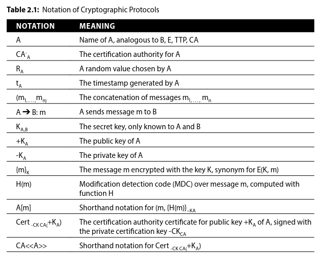

# Cryptographic Protocols and Perfect Secrecy

- Claude Shannon, often regarded as the father of information theory, defined perfect secrecy for secret-key systems and showed that perfect secrecy exists. Basically, perfect secrecy is the idea that no matter how much ciphertext you have, it will not convey anything about the contents of the plaintext or key. It can be proved that any such scheme must use at least as much key material as there is plaintext to encrypt. In terms of probabilities, this means that the probability distribution of the possible plaintext is independent of the ciphertext.

- Chapter Goals:
    - Gain an understanding of cryptography and the various attack methods
    - Explore key lengths and their importance for long term security.
    - Gain an understanding of the one-time pad
    - Create message secrecy using the binary XOR operator
    - Gain an understanding of cryptographic hashes.
    - Explore the basics of Claude Shannon's theorem.
    - Explore the concepts of perfect forward secrecy.

- The study of cryptology is broken down into two fields: cryptography and cryptanalysis.

## Understanding Cryptography

- Cryptography is the science of secret writing with the goal of hiding the meaning of the message. Cryptography is further broken down into _cryptographic protocols_, _symmetric algorithms_, and _asymmetric (or public-key) algorithms_.

- Cryptographic protocols, also known as security or encryption protocols, consist of a well-defined series of steps and message exchanges between several entities in order to achieve a specific security objective. Cryptographic protocols should encapsulate a number of properties in order to be viable:
    - The protocol must be known by each party involved, and each party must know the well defined steps to follow in advance of the protocol's use.
    - The protocol must be unambiguous; every step is well defined and easy to understand.
    - The protocol must be followed by each party involved.
    - The protocol must be complete.
    - The protocol must not give away any details about the message.

- Cryptographic protocols are used in secure application-level data transport such as Transport Layer Security (TLS), which is used to secure HTTPS web connections. Another protocol that we will explore later in the chapter is the _Diffie-Hellman key exchange_, which is also used by TLS in its secure communications. Other applications include secret splitting, secret sharing, time-stamping, key escrow, zero-knowledge proofs, blind signatures, electronic money, and securing elections. The data integrity of the message exchange process is a critical aspect of the selected protocols; data integrity is a building block for cryptographic protocols.

__Cryptography’s Famous Family: Alice and Bob__

- Eve, the passive and submissive eavesdropper
- Mallory, the malicious attacker
- Trent, trusted by all

### Diffie-Hellman

- The protocol design does offer an advantage, however; it allows the protocol to guarantee the property of perfect forward secrecy (PFS), which protects the message from a compromise of any data that has been protected with other keys prior to the compromise. To explain further, imagine that Alice and Bob both sign the data exchanged to compute the shared key (SK) with their private keys. Even if one of the private keys is compromised in the future, it will not allow a third party to decrypt the data that has been protected with the SK. Authentication can be broken down into two security service categories: data origin authentication and entity authentication.

### Data Origin Authentication

- Data origin authentication, also known as data integrity, is the security service that enables entities to verify that a message has been originated by a particular entity and that it has not been altered after the message was created. 

- One approach can be conjectured by assuming that everyone knows Alice’s public key, and that Alice can ensure data integrity of her messages by using her private key to encrypt them. Additionally, Alice can compute a _modification digest code (MDC)_ over her message and append the MDC encrypted with her private key to the message. MDC is an encryption algorithm that produces a one-way cryptographic function. With message integrity being critical to message security, cryptographic protocols often provide data origin authentication services as a building block of the protocols.

### Entity Authentication

- Entity authentication is a security service that is used between peer entities to verify the identity of each party involved. Each application that contains sensitive information should be built around entity authentication and verify the entity; authentication is typically performed using various means, such as:
    - Something you know (eg, password)
    - Something you have(eg, physical keys, cards, or tokens)
    - Something you are (eg, biometric properties such as fingerprint or retinal scans)
    - Someplace you are (eg, geolocation)

- Entity authentication sounds like something the service provider runs, like telegram to verify the users.

- Entity authentication is more than an exchange of messages. It must also provide timeliness. One cannot guarantee that any party involved in the message exchange is actively participating at the specific moment the message is received. Most authentication protocols establish a secret session key for security of the session following the authentication exchange. Two main categories of protocols are used for entity authentication:
    - __Arbitrated authentication__: A trusted third party (TTP), also known as an arbiter, is directly involved in every authentication exchange. The primary advantage is that it allows two parties (Alice and Bob) to authenticate to each other without knowing any pre-established secret. Even if Alice and Bob do not know each other, the same cryptographic key can be used. This type of key is known as a _symmetric key_. One disadvantage of arbitrated authentication is that the TTP can become a bottleneck to the process,  therefore  violating  the  availability  of  the  CIA  Triad.  Another disadvantage is that the TTP can monitor all authentication activity.

    - This confirms that entity authentication is done by a third party.

    - The CIA Triad is the implementation of confidentiality, integrity, and availability, which are important aspects to how we view the security of our solutions. You may also see the model referred to as the AIC Triad (availability, integrity, and confidentiality) to avoid confusion with the United States Central Intelligence Agency.The CIA Triad, in this context, defines confidentiality as a set of rules that limit who has access to information, integrity as the assurance that the information is accurate and trustworthy, and availability as the guarantee that the data can be reliably accessed when needed by authorized personnel or systems.

    - __Direct authentication__: Alice and Bob directly authenticate to each other. The primary advantage is that no online participation of a third party is required; therefore, the two drawbacks mentioned in arbitrated authentication do not apply. The major drawback is that it requires asymmetric cryptography or pre-established secret keys.

### Symmetric Algorithms

- Symmetric algorithms are the simplest and fastest way to encrypt and decrypt messages. They typically involve two parties, with each member having an identical key. As a memory mnemonic, think of the “S” in symmetric as the word same.

- We will be diving into many of the symmetric key algorithms such as DES, 3DES, IDEA, Blowfish, Skipjack, and AES in Chapter 6, but we mention them now to help prepare you for our discussion on historical ciphers later in this chapter. Other examples of symmetric algorithms include IPSec, Kerberos, and Point to Point.

### Asymmetric Algorithms

- Asymmetric algorithms are more complex and typically slower. In fact, many systems use asymmetric algorithms simply to swap symmetric keys and then use symmetric algorithms for the rest of the encryption operation. The key point to take away for now is that the asymmetric algorithm requires the use of two different keys: one public and one private. Messages that are encrypted with one key can only be decrypted with the other. This offers many advantages, such as nonrepudiation and the use of digital certificates.

- We will explore asymmetric algorithms and the use of public and private keys using Python in Chapter 7. An example of an asymmetric encryption algorithm is ElGamal, which is used in OpenPGP. Other examples include Elliptic curve cryptography, RSA, Diffie-Hellman key exchange, and DSA.

### The Needham-Schroeder Protocols

- In 1978, Roger Needham and Michael Schroeder invented two protocols. The first is their symmetric key protocol, which later formed the basis for the Kerberos protocol invented by MIT. This protocol aims to establish a session key between two parties on a network to protect communications.

- The second protocol was their public-key protocol, which is based on public-key cryptography. The goal of the second Needham-Schroeder protocol is to establish mutual authentication between two parties, A and B; the protocol assumes that an adversary may intercept, delay, read, copy, or forge the message in transit. The protocol also assumes that each party (Alice and Bob) has received secret keys from a trusted third party (TTP). The protocol uses shared keys for both the encryption and decryption process.

### The Otway-Rees Protocol

## Questions

- __What is a cryptographic protocols?__ are security or encryption protocols. They basically lay the foundation or define a number of steps and requirements for secure message exchange.

- __What is Diffie-Hellman key exchange and why use a key exchange?__ Lets say you have encrypted Alice's message, now to decrypt that message to Bob, Bob needs Alice's public key, so initially, how do you send Alice's public key to Bob? This is where Diffie-Hellman protocol comes in. As a key exchange protocol, Diffie-Hellman protocol does not perform any authentication. So, lets say we have a group chat between Alice, Bob and Charles, the Diffie-Hellman protocol will exchange each other's public keys but since can't perform any authentication, Eve, can potentially eavesdrop if she can become a middleman and fool the exchange protocol by saying she is say Alice. That is why the Diffie-Hellman protocol should be combined with an authentication mechanism.

- __Why would Alice append her private key for data origin authentication?__ Won't that compromise security? What if someone can decode the private key? But it does make sense, the private key can authenticate the message is from Alice, but who would authenticate it? The decryption algorithm at Bob's end? If it finds its not from Alice, what would it do? If private key can be used to validate the message is from Alice, what is the usecase for MDC?

- __What is a one-way cryptographic function?__

- __What are symmetric algorithms?__ Symmetric algorithms are the simplest and fastest way to encrypt and decrypt messages. They typically involve two parties, with each member having an identical key.

- __What are some examples of symmetric key algorithms?__ DES, 3DES, IDEA, Blowfish, Skipjack, AES, IPSec, Kerberos, Point to Point.

- __What are asymmetric (or public-key) algorithms?__ Asymmetric algorithms require the use of two different keys, one public and one private. The messages that are encrypted with one key can only be decrypted with the other.

- __What are some examples of asymmetric key algorithms?__ ElGamal, Elliptic curve cryptography, RSA, Diffie-Hellman key exchange, DSA.

- __What is the Needham-Schroeder Protocols?__ It is a combination of two protocols, one is a symmetric key protocol, that aims to establish a session key between two parties on a network to protect communication. And second, is a public-key protocol based on public-key cryptography. This is used to establish mutual authentication between two parties.

- __What is the The Otway-Rees Protocol?__ 

